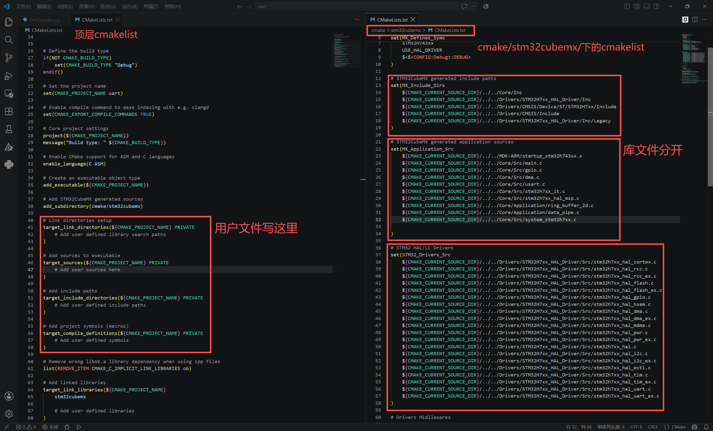

# keil2camke
Convert Keil project to a CMake project

## 注意事项
本脚本的输出文件架构依照cubemx自动生成的Cmake格式的源码组织风格，项目需要使用Cmake和ninja(加速编译)，没有这两个软件需要自行安装。

推荐将本脚本放在项目的根目录进行运行并转换。

本项目有诸多细节待补充
1. 目前只针对armclang(ARMCC6)进行转换armcc5请自行实验
2. 输出模板为F4的模板，H7，F1等其他型号请自行手动改正
3. 编译器路径采用硬编码，见代码```236```行：```set(TOOLCHAIN_PATH                "D:/Software/Keil_v5/ARM/ARMCLANG/bin/")```，请根据自己的keil安装目录及编译器目录自行修改。
4. 头文件路径和用户头文件列表都会转换到```stm32cubemx```目录下的```CMakeLists.txt```中，转化完成后请自行复制用户代码到顶层```CMakeLists.txt```,保持库文件的干净。
5. 有些时候可能存在文件路径错误的问题，请自行对照填写正确的文件路径(注意:```${CMAKE_CURRENT_SOURCE_DIR}```是当前cmakelist.txt的文件路径)

